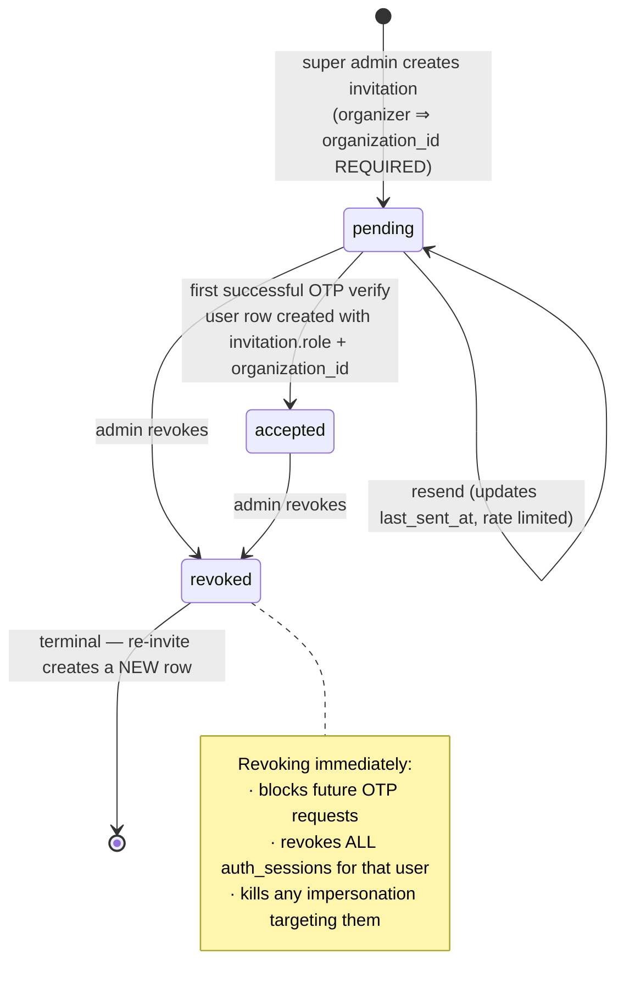

# Phase 5 — Invitation-only OTP auth, revocable sessions, impersonation

**Status:** awaiting approval. No code, migrations, email or deploys until signed off.
**Scope:** `tourney-api` (Go), `tourney-web` (SvelteKit), Supabase Postgres.
**Explicitly out of scope:** the tournament engine — scoring, scheduling, bracket
progression, timezones, public visibility, SSE, QR sharing, presentation mode,
organizer tournament workflow.

---

## 1. Singapore cutover gate — COMPLETE

Verified **2026-09-06**, not taken on trust. Every gate item passes; Phase 5 is
unblocked.

| Gate item | Evidence | |
|---|---|:--:|
| Fly `DATABASE_URL` → Singapore | Release **v5** at `2026-09-06T00:08:35Z` matches the machine's `LAST UPDATED`; secret digests stable since | ✅ |
| Fly `MIGRATION_DATABASE_URL` → Singapore | Same release | ✅ |
| `/readyz` green | `{"status":"ready"}`, sampled 3× | ✅ |
| **Region proven, not assumed** | `pool.Ping()` latency **4.0 / 4.2 / 7.1 ms**. Sydney↔Singapore is ~6,600 km — a round trip cannot be under ~90 ms, so the database is same-region | ✅ |
| Published tournaments render | `/api/v1/public/tournaments/renon-cup-2026` → **200** | ✅ |
| Row counts match snapshot | `tournaments=6 events=13 participants=72 matches=137 users=5 orgs=3 audit=485` — identical to the pre-cutover snapshot | ✅ |
| Users / orgs / tournaments / audit present | Counts above | ✅ |
| Sydney paused, retained | Pooler returns `FATAL (ENOTFOUND) tenant/user postgres.iaahwlwvxlluyyeiyssa not found` — tenant deregistered, i.e. paused. Retained as `tourney-au` | ✅ |
| goose **v12** on live database | `SELECT max(version_id) → 12` | ✅ |
| `fly.toml` comments updated | Rewritten this session: co-located, ~4 ms, was ~90 ms | ✅ |

Bonus check: `rls_gaps=none` — every public table has row-level security, so the
Supabase advisor finding that started this thread is closed on the live database.

**Cleanup:** the one-off cutover wizard (`scripts/migrate-to-singapore.sh`) and
its dump artifacts have been deleted. Sydney stays paused-but-retained as the
rollback for several days.

## 2. Repository audit

| Repo | Role | Deploy | Relevant surface |
|---|---|---|---|
| `tourney-api` | Go 1.25 + Gin modular monolith. Owns all authz. | Fly.io, app `tourney-api`, **single machine** (`--ha=false`) | `internal/auth`, `internal/platform`, `internal/audit`, `internal/server/middleware` |
| `tourney-web` | SvelteKit 2 / Svelte 5 runes | Vercel | `(auth)/login`, `(admin)/super-admin/*`, `src/lib/server/session.ts`, `hooks.server.ts` |
| `tourney-e2e` | Playwright, own workspace, own ports | — | **Not in git.** See §16. |

Module layout in the API is `handler.go` (HTTP) / `service.go` (rules) /
`repository.go` (SQL) per domain, wired by explicit constructor calls in
`cmd/api/main.go`. New auth work follows the same shape — no DI container.

**Single-machine constraint is load-bearing.** The realtime hub keeps SSE
subscribers in process, so the app is pinned to one machine. This makes
in-process rate limiting and an in-process session-revocation cache *coherent*
today, and both must move to Redis at the same time the SSE hub does.

---

## 3. Auth / session audit

| Concern | Current implementation |
|---|---|
| Login | `POST /auth/login`, email + password |
| Password hash | argon2id, PHC format, 64 MiB / t=1 / p=4, constant-time verify (`internal/auth/password.go`) |
| Access token | HS256 JWT, 15 min, claims `sub`, `role`, `org_id` |
| Refresh token | HS256 JWT, **30 days**, claims `sub` only |
| Session store | **None. Tokens are self-contained.** |
| Logout | `func (h *Handler) logout(c *gin.Context) { server.NoContent(c) }` — **no-op** |
| Refresh | Verifies signature, loads user, re-issues. **No revocation check.** |
| Browser storage | httpOnly cookies `tourney_at` / `tourney_rt`, `sameSite=lax`, `secure` outside dev |
| Web session | `hooks.server.ts` validates against `/me` each request, silently rotates on 401 |
| Role checks | `middleware.RequireRole()` at the route-group level; roles are plain strings |
| CORS | `middleware.CORS(cfg.CORSOrigins)`, comma-separated allowlist |
| Rate limiting | **None anywhere in the codebase** |

### The blocking consequence

Because there is no server-side session record, a token cannot be withdrawn.
Logout clears the cookie; the refresh JWT remains valid for **30 days** and will
mint fresh access tokens for anyone holding it. Six approved requirements are
unimplementable against this model, which is why §6 introduces `auth_sessions`.

---

## 4. Database audit

Live schema is at goose **v12** (Singapore) / **v11** (Sydney) — see §1.

```
organizations(id, name, slug UNIQUE, branding jsonb, status org_status, created_at)
users(id, email TEXT NOT NULL UNIQUE, password_hash TEXT NOT NULL,
      name, role user_role NOT NULL, org_id → organizations, created_at,
      CONSTRAINT users_org_scope CHECK (
        (role='organizer'   AND org_id IS NOT NULL) OR
        (role='super_admin' AND org_id IS NULL)))
audit_logs(id, org_id, actor_user_id, tournament_id, action, target_type,
           target_id, diff jsonb, created_at)
```

Enums present: `user_role('super_admin','organizer')`, `org_status`,
`tournament_status`, `event_discipline`, `event_format`, `event_gender`,
`pairing_mode`, `stage_kind`, `match_status`, `slot_source`.

Four facts that shape everything below:

1. **`user_role` already matches the spec exactly.** No enum change needed.
2. **`users_org_scope` is a hard CHECK.** An organizer without an `org_id`
   cannot be inserted. This is why organization assignment moves to invitation
   creation time (your decision 2) — without it, OTP verify cannot create a user.
3. **`users.email` is case-sensitive UNIQUE.** `A@x.com` and `a@x.com` can both
   exist today.
4. **`audit_logs` has one actor column.** Impersonation needs two.

Existing audit service already exposes `RecordTx` on a caller's transaction,
which the OTP-verify flow needs to make "consume OTP + accept invitation +
create session + audit" atomic. Good — no new plumbing.

---

## 5. Gap report

| # | Area | Current | Desired | Gap | Risk | Action |
|---|---|---|---|---|---|---|
| G1 | Sessions | Stateless JWT | Revocable, impersonation-aware | No session table | **High** | New `auth_sessions` (§6.1) |
| G2 | Logout | No-op | Immediate revocation | Not implemented | **High** | Revoke session row |
| G3 | Refresh | No revocation check | Blocked on revoke/suspend | Not implemented | **High** | Resolve session on refresh |
| G4 | `password_hash` | `NOT NULL` | OTP users have none | Insert fails | Med | `DROP NOT NULL`, keep data |
| G5 | Org assignment | CHECK forces org | Invited organizer needs org | Invite must carry org | **High** | `invitations.organization_id` required for organizer |
| G6 | User status | Absent | suspend / reactivate | No column | Med | `user_status` enum + column |
| G7 | Email casing | Case-sensitive | Case-insensitive | Duplicate risk | Med | Normalize + `UNIQUE(lower(email))` |
| G8 | Audit actor | Single actor | actor + effective + reason | 3 columns missing | Med | Extend `audit_logs` |
| G9 | Rate limiting | None | OTP limits | Not implemented | Med | In-process limiter |
| G10 | OTP storage | N/A | Hashed, TTL, attempts | Table missing | Med | `otp_challenges` |
| G11 | Invitations | None | Allowlist | Table missing | Med | `invitations` |
| G12 | OTP hashing | argon2id 64 MiB | Cheap + safe for 6 digits | **DoS on 256 MB VM** | **High** | HMAC-SHA256 + pepper (§6.5) |
| G13 | Admin API | 5 routes exist | Spec re-lists 3 of them | Duplication risk | Low | Reuse (§12) |
| G14 | Admin UI | `/super-admin/*` exists | Spec proposed `/admin/*` | Rename churn | Low | **Extend existing** (decision 3) |

---

## 6. Schema + migration plan

Six migrations, `00013`–`00018`, additive only. **No `DROP TABLE`, no `DROP
COLUMN`, no data deletion.** Every new table gets RLS enabled in the same
migration, per the convention `00012` established.

### 6.1 `00013_auth_sessions.sql`

```sql
CREATE TYPE session_kind AS ENUM ('normal', 'impersonation');

CREATE TABLE auth_sessions (
    id                   UUID PRIMARY KEY DEFAULT gen_random_uuid(),
    -- effective identity: who the request acts AS
    user_id              UUID NOT NULL REFERENCES users(id) ON DELETE CASCADE,
    -- real identity during impersonation; NULL for normal sessions
    actor_user_id        UUID REFERENCES users(id) ON DELETE CASCADE,
    parent_session_id    UUID REFERENCES auth_sessions(id) ON DELETE CASCADE,
    kind                 session_kind NOT NULL DEFAULT 'normal',
    refresh_token_hash   TEXT NOT NULL,
    impersonation_reason TEXT,
    ip_hash              TEXT,
    user_agent_hash      TEXT,
    created_at           TIMESTAMPTZ NOT NULL DEFAULT now(),
    last_seen_at         TIMESTAMPTZ,
    expires_at           TIMESTAMPTZ NOT NULL,
    revoked_at           TIMESTAMPTZ,
    revoked_reason       TEXT,

    CONSTRAINT auth_sessions_shape CHECK (
        (kind = 'normal'
           AND actor_user_id IS NULL AND parent_session_id IS NULL)
     OR (kind = 'impersonation'
           AND actor_user_id IS NOT NULL AND parent_session_id IS NOT NULL
           AND actor_user_id <> user_id)
    )
);

CREATE UNIQUE INDEX auth_sessions_refresh_hash_idx ON auth_sessions (refresh_token_hash);
CREATE INDEX auth_sessions_active_idx  ON auth_sessions (user_id)       WHERE revoked_at IS NULL;
CREATE INDEX auth_sessions_actor_idx   ON auth_sessions (actor_user_id) WHERE kind = 'impersonation' AND revoked_at IS NULL;

ALTER TABLE auth_sessions ENABLE ROW LEVEL SECURITY;
```

**"No nested impersonation" cannot be a CHECK** — it requires reading the parent
row. Enforced in the service: the parent must be `kind='normal'`, and an
integration test covers it.

**Token model.** JWTs are kept — they carry `role`/`org_id` cheaply — but gain a
`sid` claim, and `middleware.Auth` resolves that session on **every**
authenticated request (your decision 1):

```
revoked_at IS NULL AND expires_at > now()  →  proceed, else 401
```

This adds one indexed primary-key lookup per request. **The Singapore cutover
pays for it**: measured `pool.Ping()` latency from the Fly machine is now
**~4 ms**, where Sydney was ~90 ms. Per your decision, **no in-process
revocation cache** is added — correctness over saving one same-region indexed
lookup. If profiling later shows it matters, it is a contained change.

Access JWT claims: `sub`, `role`, `org_id`, **`sid`**. Neither `role` nor
`org_id` is trusted unless the session row validates too.

The refresh token becomes an **opaque random 32-byte value**, stored only as a
hash, and **rotates on every successful refresh**:

1. Hash the presented token, look up the session, `SELECT … FOR UPDATE`.
2. Confirm unrevoked, unexpired, effective user still `active`.
3. Generate a new 32-byte token, replace `refresh_token_hash`, bump
   `last_seen_at`, issue a new access JWT.
4. **The presented token is now dead.** Re-use returns 401.

Reuse of an already-rotated token is treated as a signal, not a retry: it is
audited and the session revoked, since a legitimate client never replays a
consumed refresh token.

### 6.2 `00014_users_otp_transition.sql`

```sql
CREATE TYPE user_status AS ENUM ('active', 'suspended');
ALTER TABLE users ADD COLUMN status user_status NOT NULL DEFAULT 'active';
ALTER TABLE users ADD COLUMN last_login_at TIMESTAMPTZ;

-- OTP users have no password. Existing hashes are PRESERVED (see §6.4).
ALTER TABLE users ALTER COLUMN password_hash DROP NOT NULL;

-- Fail loudly rather than silently merging accounts.
DO $$
DECLARE dupes TEXT;
BEGIN
    SELECT string_agg(lower(email), ', ') INTO dupes
      FROM users GROUP BY lower(email) HAVING count(*) > 1;
    IF dupes IS NOT NULL THEN
        RAISE EXCEPTION 'case-insensitive email collisions must be resolved first: %', dupes;
    END IF;
END $$;

UPDATE users SET email = lower(trim(email)) WHERE email <> lower(trim(email));
CREATE UNIQUE INDEX users_email_lower_idx ON users (lower(email));
```

CITEXT is deliberately avoided — it is not an existing project convention and
needs an extension.

### 6.3 `00015_invitations.sql`

```sql
CREATE TYPE invitation_status AS ENUM ('pending', 'accepted', 'revoked');

CREATE TABLE invitations (
    id                  UUID PRIMARY KEY DEFAULT gen_random_uuid(),
    email               TEXT NOT NULL,               -- normalized lowercase
    email_display       TEXT,                        -- as typed
    role                user_role NOT NULL,
    organization_id     UUID REFERENCES organizations(id) ON DELETE CASCADE,
    status              invitation_status NOT NULL DEFAULT 'pending',
    invited_by_user_id  UUID REFERENCES users(id) ON DELETE SET NULL,
    note                TEXT,
    created_at          TIMESTAMPTZ NOT NULL DEFAULT now(),
    accepted_at         TIMESTAMPTZ,
    revoked_at          TIMESTAMPTZ,
    last_sent_at        TIMESTAMPTZ,
    -- Pending invitations expire after 14 days; accepted ones never do.
    expires_at          TIMESTAMPTZ NOT NULL DEFAULT (now() + INTERVAL '14 days'),

    -- Mirrors users_org_scope, so an invitation can never create a user that
    -- violates it. This is decision 2 expressed as a constraint.
    CONSTRAINT invitations_org_scope CHECK (
        (role = 'organizer'   AND organization_id IS NOT NULL) OR
        (role = 'super_admin' AND organization_id IS NULL)
    )
);

CREATE UNIQUE INDEX invitations_email_active_idx
    ON invitations (email) WHERE status <> 'revoked';

ALTER TABLE invitations ENABLE ROW LEVEL SECURITY;
```

`invitations_org_scope` is the load-bearing piece: it makes "organizer
invitation without an organization" **impossible at the database level**, so a
bug in the admin UI cannot produce an invitation that later fails at OTP verify.

**Active** = not `revoked`, and (`status = 'accepted'` OR `expires_at > now()`).
An accepted invitation stays valid regardless of `expires_at`; only *pending*
ones age out, after **14 days**.

**Re-invitation never revives history.** `revoked` is terminal. Re-inviting a
revoked address **inserts a new row**; the partial unique index
`(email) WHERE status <> 'revoked'` permits exactly one active invitation per
address while keeping every revoked row for audit. No `ON CONFLICT` path may
touch a revoked row — the bootstrap in §6.7 is scoped accordingly. Expired
pending invitations are **not deleted**, merely inactive.

### 6.4 `password_hash` transition strategy

Three stages, reversible until the last:

| Stage | Action | Reversible |
|---|---|---|
| **A** (this phase) | `DROP NOT NULL`. Existing hashes untouched. `POST /auth/login` still works, gated by `AUTH_PASSWORD_LOGIN_ENABLED` (**default `false`**). | Yes — flip the flag |
| **B** (after OTP verified in production) | Flag stays off for a full cycle. Password code and tests remain in the tree. | Yes |
| **C** (separate later phase) | Delete password login code, `DROP COLUMN password_hash`. | **No** |

Stage C is explicitly *not* in Phase 5. The flag is the rollback lever: if OTP
delivery fails in production, flip it to `true` and password login is live again
with no deploy of new code.

### 6.5 `00016_otp_challenges.sql`

```sql
CREATE TABLE otp_challenges (
    id              UUID PRIMARY KEY DEFAULT gen_random_uuid(),
    email           TEXT NOT NULL,                   -- normalized lowercase
    purpose         TEXT NOT NULL DEFAULT 'login',
    code_hash       TEXT NOT NULL,
    invitation_id   UUID REFERENCES invitations(id) ON DELETE SET NULL,
    attempts        INT NOT NULL DEFAULT 0,
    max_attempts    INT NOT NULL DEFAULT 5,
    created_at      TIMESTAMPTZ NOT NULL DEFAULT now(),
    expires_at      TIMESTAMPTZ NOT NULL,
    consumed_at     TIMESTAMPTZ,
    invalidated_at  TIMESTAMPTZ,
    last_attempt_at TIMESTAMPTZ,
    requested_ip_hash   TEXT,
    request_user_agent_hash TEXT
);

CREATE INDEX otp_challenges_active_idx ON otp_challenges (email, purpose, expires_at)
    WHERE consumed_at IS NULL AND invalidated_at IS NULL;

ALTER TABLE otp_challenges ENABLE ROW LEVEL SECURITY;
```

**OTP hashing — deliberate departure from argon2id.**

`HashPassword` uses argon2id at **64 MiB per call**. The API VM is
`shared-cpu-1x` / **256 MB** (`fly.toml`). Four concurrent OTP verifications
would exhaust the machine — a trivially reachable denial of service on an
unauthenticated endpoint.

A 6-digit code has a 10⁶ keyspace; a memory-hard KDF buys almost nothing there.
The real defenses are the **10-minute TTL**, the **5-attempt cap** and the
**rate limits**. So OTP codes use `HMAC-SHA256(code, OTP_PEPPER)` with a
constant-time compare, where `OTP_PEPPER` is a Fly secret. Cheap, constant
memory, and an attacker with database read access still cannot brute-force
offline without the pepper.

Password hashing is untouched and stays argon2id.

### 6.6 `00017_audit_impersonation.sql`

```sql
ALTER TABLE audit_logs ADD COLUMN effective_user_id UUID REFERENCES users(id) ON DELETE SET NULL;
ALTER TABLE audit_logs ADD COLUMN impersonation_session_id UUID REFERENCES auth_sessions(id) ON DELETE SET NULL;
ALTER TABLE audit_logs ADD COLUMN reason TEXT;
CREATE INDEX audit_logs_impersonation_idx ON audit_logs (impersonation_session_id)
    WHERE impersonation_session_id IS NOT NULL;
```

`actor_user_id` keeps its meaning (**who really acted**). `effective_user_id` is
the impersonated organizer, NULL outside impersonation. Existing rows are
unaffected, so current audit views keep working.

### 6.7 `00018_bootstrap_super_admin.sql`

Idempotent, database-backed, no email string in any runtime authorization path.

```sql
INSERT INTO invitations (email, email_display, role, organization_id, status, accepted_at, note)
VALUES (lower('kgobang570@gmail.com'), 'kgobang570@gmail.com', 'super_admin', NULL, 'accepted', now(), 'bootstrap')
ON CONFLICT (email) WHERE status <> 'revoked'
DO UPDATE SET role = 'super_admin', status = 'accepted', revoked_at = NULL;

INSERT INTO users (email, name, role, org_id, status, password_hash)
VALUES (lower('kgobang570@gmail.com'), 'Super Admin', 'super_admin', NULL, 'active', NULL)
ON CONFLICT (lower(email))
DO UPDATE SET role = 'super_admin', status = 'active', org_id = NULL;
```

Chosen as a **migration**, not a seed: Fly's `release_command` runs
`/app/migrate up` on every deploy, but never `make seed`, so a migration is the
only path that reaches production automatically. Re-running is a no-op.

> **Role changes must be atomic with `org_id`.** `users_org_scope` means
> promoting organizer → super_admin has to null `org_id` in the *same*
> statement, and demoting requires an `organization_id` argument. The
> `PATCH /admin/users/:id` handler enforces this; a test covers both directions.

---

## 7. OTP sequence diagram

```mermaid
sequenceDiagram
    autonumber
    participant B as Browser
    participant W as tourney-web (SvelteKit server)
    participant A as tourney-api (Go)
    participant D as Postgres
    participant P as Plunk

    Note over B,P: Step 1 — request a code
    B->>W: POST /login (email)
    W->>A: POST /api/v1/auth/otp/request
    A->>A: normalize: trim + lowercase + shape check
    A->>A: rate limit by email (3/10min) and IP (10/hr)
    A->>D: SELECT active invitation WHERE email = $1
    alt no active invitation
        A-->>W: 403 not_invited
        W-->>B: "This email has not been invited to Tourney.social."
        A->>D: audit auth.otp_request_rejected
    else invited
        A->>D: UPDATE otp_challenges SET invalidated_at = now() (prior active)
        A->>A: crypto/rand 6-digit code
        A->>D: INSERT otp_challenges (HMAC-SHA256 hash, expires_at = now()+10min)
        A->>P: send OTP email (server-side only)
        A->>D: audit auth.otp_requested
        A-->>W: 200 generic success
    end

    Note over B,P: Step 2 — verify
    B->>W: POST /login (email + code)
    W->>A: POST /api/v1/auth/otp/verify
    A->>D: BEGIN; SELECT ... FOR UPDATE (locks the challenge row)
    A->>A: re-check invitation still active
    alt expired / consumed / invalidated / attempts >= max
        A->>D: audit auth.otp_expired or auth.otp_failed; COMMIT
        A-->>W: 401 code_expired or invalid_code
    else hash mismatch
        A->>D: UPDATE attempts = attempts + 1; audit auth.otp_failed; COMMIT
        A-->>W: 401 invalid_code
    else match
        A->>D: UPDATE consumed_at = now()
        A->>D: UPDATE invitations SET status='accepted', accepted_at=now()
        A->>D: UPSERT users (role + org_id FROM invitation)
        A->>D: INSERT auth_sessions (kind='normal', refresh hash)
        A->>D: audit auth.otp_verified, invitation.accepted
        A->>D: COMMIT
        A-->>W: 200 { id, email, name, role }
        W->>B: set httpOnly cookies; redirect by role
    end
```

The whole verify path runs in **one transaction with `SELECT … FOR UPDATE`** on
the challenge row, which is what makes OTP replay under concurrency impossible
rather than merely unlikely.

---

## 8. Invitation state machine



**Active** = `pending` or `accepted`, and not past `expires_at`.
**Revoked is terminal** — re-inviting inserts a new row, so the audit trail of
the original decision survives. The partial unique index
`(email) WHERE status <> 'revoked'` permits exactly one active invitation per
email while allowing any number of historical revoked ones.

Organization assignment (decision 2), as a table:

| Invitation role | `organization_id` | On accept, user gets |
|---|---|---|
| `organizer` | **required**, DB-enforced | `role='organizer'`, `org_id = invitation.organization_id` |
| `super_admin` | must be NULL, DB-enforced | `role='super_admin'`, `org_id = NULL` |

Multi-org membership is **not** built — the current schema has a single
`users.org_id` and adding a join table is out of scope for this refactor.

---

## 9. Role / permission matrix

Effective permissions during impersonation are the **organizer's**, always.

| Capability | organizer | super_admin | super_admin *impersonating* |
|---|:--:|:--:|:--:|
| Own org tournaments — read/write | ✅ | ✅ | ✅ (target's org) |
| Other orgs' tournaments | ❌ | ✅ | ❌ |
| Publish / unpublish own tournament | ✅ | ✅ | ✅ |
| Force publish / unpublish / archive any | ❌ | ✅ | ❌ |
| `/admin/*` API | ❌ | ✅ | ❌ |
| Invitations — list / create / revoke / resend | ❌ | ✅ | ❌ |
| Users — list / role change / suspend | ❌ | ✅ | ❌ |
| Platform audit log | ❌ | ✅ | ❌ |
| Start impersonation | ❌ | ✅ | ❌ (no nesting) |
| **Exit impersonation** | ❌ | n/a | ✅ (only own impersonation session) |
| Platform settings | ❌ | ✅ | ❌ |

Two invariants enforced server-side, each with a test:

- **The last active super_admin cannot be demoted or suspended** — by anyone,
  including themselves. Guard runs inside the same transaction as the update.
- **Authorization never compares email strings.** After `00018`, `super_admin`
  is a database role assignment only.

---

## 10. `/super-admin` extension plan (decision 3)

Existing routes are kept and extended. **No renames, no broken links.**

| Route | State | Work |
|---|---|---|
| `/super-admin` | exists | Extend to the overview counters in §14 |
| `/super-admin/organizers` | exists | Extend into user management (role, suspend, impersonate) |
| `/super-admin/tournaments` | exists | Add force publish/unpublish/archive + reason dialog |
| `/super-admin/audit` | exists | Add filters + impersonation columns |
| `/super-admin/invitations` | **new** | Full CRUD |
| `/super-admin/settings` | **new** | Small: timezone display, Plunk sender status, self-test |

Guard stays where it is — `(admin)/+layout.server.ts` — with a `super_admin`
check added for the `super-admin/*` subtree. It remains **UX only**; the API is
the boundary.

---

## 11. Impersonation design

### Start

`POST /api/v1/admin/users/:id/impersonate` — `RequireSuperAdmin`.

Server validates, in one transaction:

1. Caller's session is `kind='normal'` — **blocks nesting**
2. Caller role is `super_admin`
3. Target exists, `role='organizer'`, `status='active'` — **a suspended
   organizer can never be impersonated; reactivate first (decision 4)**
4. Target ≠ caller — **blocks self-impersonation**
5. Caller has no other active impersonation session
6. Target's invitation is active

Then inserts `auth_sessions(kind='impersonation', user_id=target,
actor_user_id=caller, parent_session_id=caller_session, impersonation_reason)`
and issues a token pair bound to it, TTL **30 minutes**.

### Cookie strategy

The impersonation tokens **replace** `tourney_at` / `tourney_rt`. The
super-admin session is *not* in the browser at all — it survives as its own
`auth_sessions` row, referenced by `parent_session_id`.

Rejected alternative: a second cookie pair holding the admin session. That
places a second live credential in the browser for the entire impersonation and
gains nothing, since the server can already find the parent row.

Exit therefore cannot use `RequireSuperAdmin` — the effective role is organizer.
`POST /api/v1/admin/impersonation/exit` authorizes on the session itself:

```
session.kind = 'impersonation' AND session.actor_user_id IS NOT NULL
```

It revokes **only** the impersonation session, then re-issues tokens for
`parent_session_id` after confirming the parent is still unrevoked and the
parent user is still an active super_admin. **No user id is ever accepted from
the browser.**

### During

`GET /me` gains a non-sensitive block the banner renders:

```jsonc
{ "data": { "id": "...", "email": "...", "role": "organizer",
            "impersonation": { "actor_email": "admin@…", "started_at": "…" } } }
```

Every mutation writes `actor_user_id` = super admin, `effective_user_id` =
organizer, `impersonation_session_id`, and `reason`.

### Cascade revocation

| Event | Sessions revoked |
|---|---|
| Sign out (normal session) | Current session **and** any child impersonation sessions found via `parent_session_id` |
| **Sign out while impersonating** | Impersonation session **and** its parent super-admin session — full sign-out, cookies cleared, back to login |
| **Exit impersonation** | Impersonation session **only**; parent restored. **Never behaves like sign-out** |
| User suspended | All sessions where `user_id = target` **or** `actor_user_id = target` |
| Invitation revoked | Same as suspension |
| Super admin suspended/demoted | All their sessions, including impersonations they started |
| Refresh-token reuse detected | That session, treated as a compromise signal |

---

## 12. API endpoint map

**Reused as-is — do not duplicate:**

| Existing route | Covers |
|---|---|
| `GET /api/v1/admin/audit-logs` | §5E audit log — extend filters only |
| `GET /api/v1/admin/organizations` · `POST /api/v1/admin/organizations` | Org list/create |
| `GET /api/v1/admin/tournaments` | Platform tournament oversight — extend response |
| `POST /api/v1/admin/tournaments/:id/status` | **Already does force publish/unpublish/archive.** Add a `reason` field; do **not** add `PATCH /admin/tournaments/:id` |
| `POST /api/v1/auth/refresh` · `POST /api/v1/auth/logout` · `GET /api/v1/me` | Keep paths; logout becomes real |

**New:**

```
POST   /api/v1/auth/otp/request      # also serves resend; no separate endpoint
POST   /api/v1/auth/otp/verify

GET    /api/v1/admin/overview
GET    /api/v1/admin/invitations
POST   /api/v1/admin/invitations
PATCH  /api/v1/admin/invitations/:id        # revoke
POST   /api/v1/admin/invitations/:id/resend
GET    /api/v1/admin/users
GET    /api/v1/admin/users/:id
PATCH  /api/v1/admin/users/:id              # role / status, atomic with org_id
POST   /api/v1/admin/users/:id/impersonate
POST   /api/v1/admin/impersonation/exit     # authorized by session, not role
GET    /api/v1/admin/settings
PATCH  /api/v1/admin/settings
POST   /api/v1/admin/settings/plunk-test    # sends ONLY to caller's own email
```

`POST /auth/login` is retained behind `AUTH_PASSWORD_LOGIN_ENABLED=false`.
No `/auth/otp/resend` — request is idempotent under its own rate limit.

Error codes follow the existing envelope. The web app keys off `code`, never the
message: `not_invited` (403), `invitation_expired` (403), `account_suspended` (403),
`invalid_code` (401), `code_expired` (401), `otp_rate_limited` (429),
`invalid_email` (422).

---

## 13. Audit event map

New actions on the existing `audit_logs` table:

```
auth.otp_requested          auth.otp_request_rejected    auth.otp_rate_limited
auth.otp_verified           auth.otp_failed              auth.otp_expired
auth.logout

admin.invitation_created    admin.invitation_resent      admin.invitation_revoked
invitation.accepted

admin.user_role_changed     admin.user_suspended         admin.user_reactivated

admin.tournament_force_published    admin.tournament_force_unpublished
admin.tournament_archived           admin.tournament_restored

admin.impersonation_started admin.impersonation_ended    admin.impersonation_denied
```

**Never written to `diff`, logs, or any response:** plaintext OTP codes, OTP
hashes, raw JWTs, refresh tokens, cookie values, `PLUNK_API_KEY`, `OTP_PEPPER`,
database credentials, raw Plunk response bodies, `Authorization` headers.

A unit test greps serialized audit payloads for the active OTP code and fails if
present.

---

## 14. UI / component plan

Existing tokens only — `Button`, `Field`, `Modal`, `Tabs`, `Badge`, `Chip`,
`RowMenu`, `EmptyState`, `ErrorState`, `Spinner`, and the toast conventions in
`src/lib/utils/toast.ts`.

> **Palette correction.** The brief says "dark-blue theme"; the actual tokens in
> `src/routes/layout.css` are near-black `--color-page:#0d0d0f` on
> `--color-surface:#151517`, with a single gold accent `--color-accent:#d4a94e`,
> Instrument Serif headings and Geist Mono for numerics. **The code is the
> source of truth** — no blue is introduced. Flagging in case the brief means a
> separate redesign, which would be its own phase.

### Login — two steps, one route

`(auth)/login` keeps its route and its `+page.server.ts` form-action pattern.

- **Step 1** — email field, "Continue", helper text *"Use the email address your
  organizer invited."* Inline `not_invited` and `otp_rate_limited` errors.
- **Step 2** — six-digit code. `inputmode="numeric"`,
  `autocomplete="one-time-code"` (enables iOS/Android SMS-style autofill),
  Geist Mono, generous tracking. Shows the email with a "Change email" action, a
  live expiry countdown, and a resend button disabled until the server's
  cooldown elapses.
- Success routes by role: `super_admin` → `/super-admin`, organizer → existing
  landing. Unchanged afterwards.

Accessibility: labelled inputs, `aria-live="polite"` on the error region, focus
moves to the code field on step change and to the error on failure, visible
focus rings, full keyboard operation, `prefers-reduced-motion` respected on the
step transition. No password field anywhere.

### Impersonation banner

Fixed top bar on every page of an impersonated session, gold `--color-accent`
left border on `--color-subtle`, above all content, not dismissible:

> **Impersonating organizer@example.com** — actions are logged. `[Exit impersonation]`

Rendered from `/me`'s `impersonation` block, so it cannot be spoofed or hidden
by client state.

### Plunk sender abstraction

```go
// internal/email/sender.go
type Sender interface {
    SendOTP(ctx context.Context, to, code string) error
    SendInvitation(ctx context.Context, to, role string) error
}
```

- `PlunkSender` — real HTTP client. Reads `PLUNK_API_KEY` from env (Fly secret).
  On failure returns a generic error; the provider body is **never** surfaced or
  logged.
- `FakeSender` — records `(to, code)` in memory. Used by **all** unit,
  integration and browser tests, injected at construction in
  `cmd/api/main.go`, exactly like every other dependency.
- A guard in `NewPlunkSender` refuses to construct when `APP_ENV != production`
  unless `PLUNK_ALLOW_REAL_SEND=true`, so a stray test run cannot email a real
  person.

---

## 15. Test matrix

### Unit — `internal/auth`, `internal/email` (no database)

Email normalization (trim/case/invalid shapes) · OTP is 6 digits from
`crypto/rand` · HMAC hash/verify round-trip · constant-time compare · expired
rejected · consumed rejected · invalidated rejected · attempt increment · lock at
max attempts · new request invalidates prior · role+org derived from invitation ·
**no plaintext OTP in any serialized audit payload** · session shape CHECK logic ·
last-super-admin guard.

### Integration — `internal/inttest`, real database, `FakeSender`

| Area | Cases |
|---|---|
| Request | invited → 200 · uninvited → 403 `not_invited` · revoked → 403 · suspended → 403 · rate limit → 429 |
| Verify | valid → session + `invitation.accepted` · invalid → 401 · expired → 401 · max attempts → 429/locked · replay rejected · **code for email A cannot verify email B** |
| Sessions | logout revokes immediately · refresh fails after revoke · suspension revokes all · invitation revoke revokes all · **no raw JWT in any public payload** |
| Authz | organizer → 403 on every `/admin/*` · unauthenticated → 401 · super admin can list all · `kgobang570@gmail.com` is super_admin after migrate · last super admin cannot be demoted or suspended · role change audited · force publish audited · **force unpublish blocks public read, OG injection and public SSE** |
| Impersonation | super admin → active organizer ✅ · organizer → anyone ❌ · self ❌ · other super admin ❌ · nested ❌ · effective perms are organizer's · audit has both actors · exit restores parent · logout kills both · suspending target kills it · denied attempt audited · admin routes stay closed to the impersonated session |

Extends the existing `-tags integration` suite; `make test-integration` unchanged.

### Browser — `tourney-e2e` only, no new `tourney-web` deps

OTP login happy path · uninvited error copy · invalid code · expired code ·
resend cooldown · organizer redirect · super-admin redirect · `/super-admin`
blocked for organizer · invitation create/revoke/resend confirmations · role
change confirmation · suspend/reactivate confirmation · force publish/unpublish
confirmation with reason · impersonation confirmation dialog · banner persists
across organizer pages · organizer dashboard fully functional while impersonated ·
exit returns to `/super-admin` · **no raw JWT in any client payload** in both
normal and impersonated sessions · admin layout at desktop and mobile widths.

### Manual, real email — after approval, production only

Sender domain verified in Plunk · SPF/DKIM/DMARC pass · deliver to
`kgobang570@gmail.com` · code arrives < 60 s and works · expiry copy correct ·
`fly logs` contains **no** OTP value · rate limit observed from a real client ·
`/super-admin/settings` self-test sends only to the caller.

---

## 16. Rollback plan

Per-layer, most-likely first:

| Failure | Rollback | Data loss |
|---|---|---|
| OTP delivery broken in production | `fly secrets set AUTH_PASSWORD_LOGIN_ENABLED=true` — password login returns, no deploy | None |
| Session lookup too slow | Enable the in-process revocation cache (config flag) | None |
| Bad admin UI release | Vercel instant rollback to previous deployment | None |
| Migration `00013`–`00017` wrong | `go run ./cmd/migrate down` per step; all are additive, so down drops only new objects | New sessions/invitations/OTPs only |
| `00018` bootstrap wrong | Idempotent — correct the row and re-run | None |
| Total auth failure | Roll Fly to previous release; `00014` left `password_hash` **populated and intact** | None |

`00012`-style irreversibility does not recur here: every migration in this phase
has a real `down`, because none delete data. The one-way door is Stage C in
§6.4, which is a separate future phase.

**`tourney-e2e` is not in version control.** Before Phase 5 adds browser tests to
it, it must be committed somewhere, or the entire browser suite has no rollback
point. Recommend folding it into the monorepo discussed earlier, or giving it
its own repo. **This is a prerequisite, not a nice-to-have.**

---

## 17. Open questions / blockers

Your locked decisions closed every question from the previous draft — session
TTLs, refresh rotation, no revocation cache, 14-day pending expiry, suspended
organizers not impersonatable, exit-vs-sign-out semantics, and revoked
invitations never being revived. Three items remain.

### B1 — `tourney-e2e` is not in version control (blocker)

The directory has **no `.git` and no remote**. It exists only on this machine,
and it hardcodes `../../tourney-api` and `../../tourney-web`, including reading
the API's `.env`. Phase 5's browser suite is specified to live there.

Adding tests to an untracked directory gives the entire browser layer no
rollback point and no way for CI or another machine to run it. **This must be
resolved before Subphase 5 begins** — not before 1–4, which add no browser
tests. Either fold it into the monorepo discussed earlier, or give it its own
repository.

### B2 — `PATCH /api/v1/admin/settings` has nowhere to persist

The endpoint map includes it, but none of migrations `00013`–`00018` creates a
settings store, and there is no existing `platform_settings` table. The
platform default timezone currently lives as a constant (`Asia/Makassar`).

Recommendation: **ship Settings read-only in v1** — display the default
timezone, Plunk sender configuration status, and API health, plus the
send-test-to-self action. Drop `PATCH /admin/settings` from this phase. A
writable platform default needs its own table *and* a decision about what it
means for existing tournaments, which your own constraint ("must not
retroactively alter existing tournament zones") says is not a one-line change.
If you want it writable in v1, that is a seventh migration and a design
question, and I would rather raise it than smuggle it in.

### B3 — Plunk secrets are yours to set

`PLUNK_API_KEY`, `PLUNK_FROM_EMAIL`, `PLUNK_FROM_NAME`, `OTP_PEPPER` and
`PLUNK_ALLOW_REAL_SEND` are set by you directly in Fly and in the gitignored
local `.env`. I will not ask for, echo, or store any `sk_` value. Until they
exist, every test path uses `FakeSender`, and the manual real-email test in §15
stays blocked. Nothing else in Phase 5 depends on them.

---

## Proposed subphase sequence

Each subphase ends with the report you specified — files, migrations,
endpoints, routes, tests, commands, results, fake-email behaviour, security
notes, limitations, rollback — and none is claimed complete without its tests
passing.

| # | Subphase | Contents | Gate |
|---|---|---|---|
| 1 | Schema | `00013`–`00018`, applied to a scratch database first, then Singapore | Migrations up **and** down cleanly; `rls_gaps=none` |
| 2 | Sessions | `auth_sessions`, `sid` claim, opaque rotating refresh, real logout, revocation cascade | Integration: revoke, rotate, reuse-detection, cascade |
| 3 | OTP + invitations | HMAC codes, rate limits, `Sender` interface, `FakeSender`, invitation CRUD | Integration: the full OTP matrix in §15 |
| 4 | Impersonation | Start/exit, banner state on `/me`, audit with both actors | Integration: all 14 impersonation cases |
| 5 | Frontend | Two-step login, `/super-admin/invitations`, `/super-admin/settings`, extensions to existing pages, banner | `pnpm check`, `pnpm test`, then browser tests **after B1** |
| 6 | Production | Plunk domain verification, secrets, manual email test | Manual checklist in §15 |

Awaiting your approval on B2 and this sequence. No code until then.
